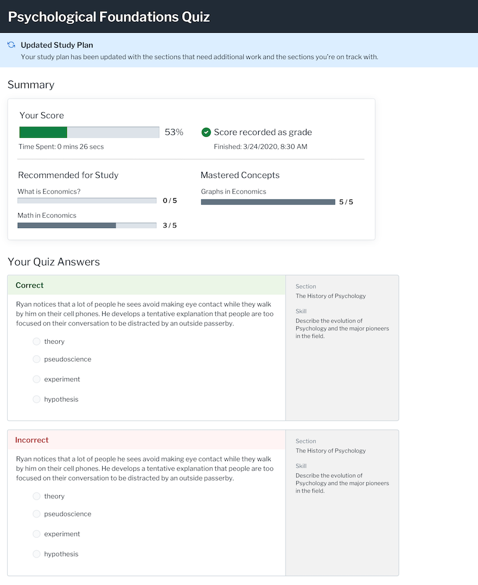

# Lumen Learning Code Review Exercise (Vue.js)

## Purpose

We're interested in how you respond to code at both a technical level and a team level and have created this exercise to mimic your review of a teammate's new feature implementation in this simplified Vue.js app.

## Instructions

1. Read this complete README, which provides details about this exercise and repo.
1. Navigate to the open pull request within this repo and look over the PR description and the code changes being put forth.
1. Using the [provided code review template](./REVIEW_TEMPLATE.md), please record your thoughtful response on how to improve the code, what you believe is particularly praiseworthy in the code, and any advice which you would offer or questions you woudl ask of your teammate submitting this pull request.
1. The template includes instructions on how to format and submit your code.

### Advice
- Please do not spend more than 90 minutes on this.
- Please focus your code review on what you know and are comfortable with instead of researching things that are unknown to you. For example, if you are unfamiliar with TypeScript but comfortable with Sass or the markup for SVGs, it is totally acceptable to not comment on the types and instead focus your review on what you know.

### Important note

⚠️ Please **do not modify this repo directly**, including forking on GitHub or adding notes to the pull request.

⚠️ It is important for our process that we can review your work without the context or association of your GitHub account/details.

## Context for the pull request

### Team details

- **Developer A** has fifteen years of experience (including three at this company). They were responsible for selecting the framework and initially setting up this project.
- **Developer B** has four years of experience (including one at this company). This is their first Vue.js project.
- **You** are another developer working in this codebase and providing feedback on Developer B's efforts.

### Background

**Developer A** has been working on a new front end for student and teacher review of assessments/quizzes.

> The code in this repo is limited to the the summary screen a student sees after taking a quiz. Additionally, while the project uses an API endpoint to get each student's quiz data, here it is being mocked as static JSON (see `src/data/quiz.json`).

This PR is one story within an epic to create a final version of the screen that will look like this:



**Developer A** has completed the summary layout, including the page header; the display of the individual quiz answers, including the skills sidebar; and added an initial score display.

**Developer B** has picked up the story for the next stage of development.

Like all of our work, this feature should be usable by all users. Specifically, Lumen supports:
- the last two versions of Google Chrome, Microsoft Edge, Apple Safari (macOS only), Mozilla Firefox
- latest Google Chrome and Mozilla Firefox on iOs and Android; Apple Safari on iOS
- keyboard navigation
- NVDA on Mozilla Firefox
- JAWS on Google Chrome and Microsoft Edge

### Story description

As a student user, I want to easily understand my quiz score, including the grade and how it compared to my other quiz attempts.

### Acceptance criteria

- A large score bar provides a visual representation of the percentage of questions answered correctly in this quiz attempt.
  - The score bar provides meaningful information to screen reader users.
- Student users can see the date and time they submitted the quiz and the time they spent on the quiz.
- If this quiz attempt (students have a minimum of 2 attempts per quiz) represents a student's highest score, the student sees the text "Score recorded as grade" and an icon is displayed; otherwise, no message or icon is displayed.
- The look of the summary in the browser approximates the provided comp.

## About this repo

⚠️ Note that there is **no expectation or requirement** for you to run this code or the code from the pull request locally. We would much rather you spend the time reading the code and responding to it than fighting with your local environment. Truly.

So, if you don't have `npm` set up on the machine you're looking at this on, feel free to ignore this.

### Project setup

```
npm install
```

### Compiles and hot-reloads for development

```
npm run serve
```

### Compiles and minifies for production

```
npm run build
```

### Runs tests

```
npm run test
```

### Lints and fixes files

```
npm run lint
```

## File structure

### `/layouts`

Layouts rendered by top level component (App.vue)

### `/views`

Page-level components to be render by Vue Router (see `/router`).

### `/components`

Smaller application components to be rendered by page-level components.

### `/components/layout`

Smaller components that are the building blocks of various `/layouts`, such as headers, footers and nav bars.

### `/router`

[Vue-Router](https://router.vuejs.org/), Vue's official router. For now, a single router file that renders `/views` components.

### `/store`

[Vuex](https://vuex.vuejs.org/) store using a modular pattern. Each feature/page has a store which is imported into `store/index.js`.
